# Skeleton of an OOP Minimum Plant Model
This code served as the first artifact for thinking about the objects within the minimum plant model and their potential relations. The objective was to take a literal view of the soil, plant, and atmosphere as a physical entities and map computational objects onto these physical entities. This code serves as a computational artifact in the model iteration process.

## Class Diagram

```mermaid
classDiagram
    Weather --* CropSimulation
    Soil --* CropSimulation
    Plant --* CropSimulation
    CropManagement --* CropSimulation

    class Weather {
        -temperature: float
        -humidity: float
        -rainfall: float
        -sunlight: float
        -wind_speed: float
        __init__(temperature, humidity, rainfall, sunlight, wind_speed)
    }
    
    class Soil {
        -layers: int
        -moisture_content: float
        -nutrient_content: float
        -pH: float
        -sand: float
        -silt: float
        -clay: float
        __init__(layers, moisture_content, nutrient_content, pH, sand, silt, clay)
        update_moisture(rainfall, evaporation_rate)
        update_nutrient(initial_nutrient_content, nutrient_uptake_rate)
    }

    class EnvironmentalStress {
        -drought: bool
        -heat_stress: bool
        -frost: bool
        __init__()
        update_stress_factors(weather)
    }
    
    class PlantOrgans {
        -nitrogen: float
        -carbon: float
        -biomass: float
        __init__(nitrogen, carbon, biomass)
        grow()
        respire()
        senesce()
    }

    PlantOrgans <|-- Leaf
    PlantOrgans <|-- Root
    PlantOrgans <|-- Stem
    PlantOrgans <|-- ReproductiveOrgan

    class Leaf {
        -temperature: float
        __init__(temperature, nitrogen, carbon, biomass)
        transpiration()
        photosynthesis()
        senescence()
    }

    class Root {
        -length: float
        -diameter: float
        __init__(length, diameter, nitrogen, carbon, biomass)
        grow()
        senescence()
    }

    class Stem {
        -height: float
        __init__(height, nitrogen, carbon, biomass)
        grow()
    }

    class ReproductiveOrgan {
        __init__(nitrogen, carbon, biomass)
        sink_material()
    }

    class Plant {
        -cultivar: string
        -age: int
        -height: float
        -development_stage: int
        -leaf_area_index: float
        -root_depth: float
        -biomass: float
        -nitrogen_content: float
        -carbon_content: float
        -water_status: float
        __init__(cultivar)
        growth_developmental_stage()
        biomass_formation()
        carbon_accumulation()
        carbon_partitioning()
        nitrogen_accumulation()
        nitrogen_partitioning()
        nitrogen_demand()
        canopy_photosynthesis()
        canopy_transpiration()
        leaf_area_development()
        respond_to_stress(environmental_stress)
    }

    class CropManagement {
        -irrigation_schedule: string
        -fertilization_plan: string
        __init__(irrigation_schedule, fertilization_plan)
        irrigate(soil, amount)
        fertilize(soil, nutrient_type, amount)
    }

    class CropSimulation {
        -plant: Plant
        -soil: Soil
        -weather: Weather
        -management: CropManagement
        __init__(plant, soil, weather, management)
        run_simulation(days)
    }


```

